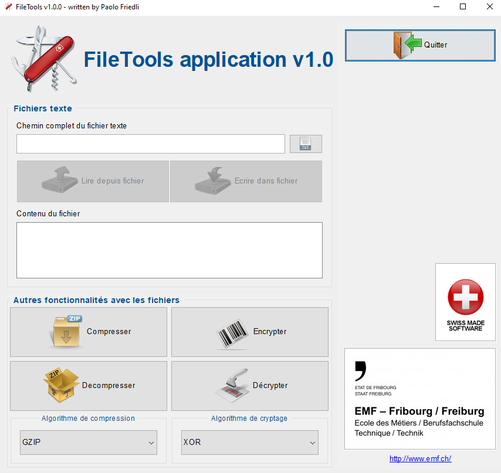

# FileTools - Flux

## Contexte
Le projet `FileTools` est un exercice qui vous permettra d’aller plus loin avec les flux en expérimentant la compression de données ainsi que l’encryptage. 
Le projet qui vous est donné est complet ð toutes les classes sont déclarées ainsi toutes leurs méthodes. Elles sont toutes implémentées mis à part celles concernées par cet exercice.
 
## Interface utilisateur

## Travail à réaliser
- Commencez par étudier les liens existants entre les classes, les interfaces, l’héritage éventuel
- Produisez un diagramme UML des classes MVC (sans les sous-workers) avec EntrepriseArchitect
- Produisez un diagramme UML des classes des workers et sous-workers avec EntrepriseArchitect
- Implémentez les méthodes manquantes des workers spécialisés ; cherchez par vous-même comment faire et les classes concernées (Zip, Gzip, .. font toutes font partie de Java).
- En vous basant sur les enseignements reçus avec les flux texte, faites de même ici afin de rendre votre code le plus robuste possible dans tous les cas de figure
- Testez soigneusement l’application afin de vérifier que son comportement soit bien celui souhaité 
